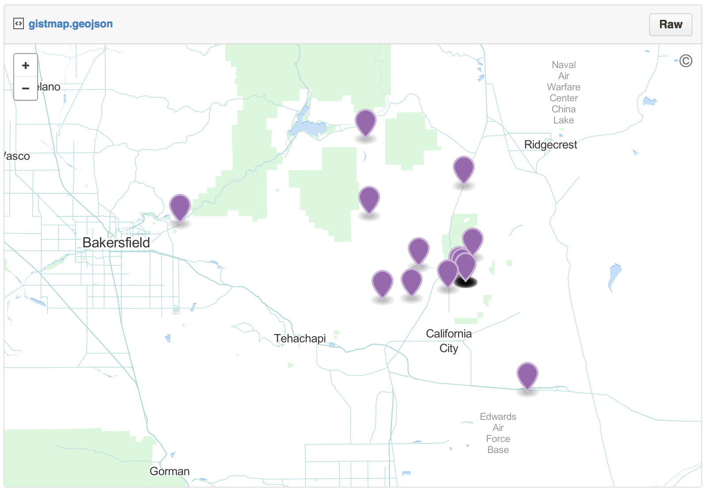

```{r echo=FALSE}
knitr::opts_chunk$set(
  comment = "#>",
  message = FALSE,
  warning = FALSE
)
```

## Biodiversity Mapping

```{r}
library('spocc')
library('mapr')
```

### Make a map using ggplot2

```{r ggplot2}
ebird_data <- occ(query = 'Accipiter striatus', from = 'ebird')
map_ggplot(ebird_data)
```

### Make a map using GitHub gists

If you have a Github Account, you can get an interactive map on Github in one line of code. The map will open in your default browser. 

```{r gistmap, eval=FALSE}
map_gist(ebird_data, color = c("#976AAE", "#6B944D", "#BD5945"))
```




## Your turn

- 5 min

> Use the other mapping options in mapr with spocc output. Also try 
to use rgbif and and make maps wit that output. 
