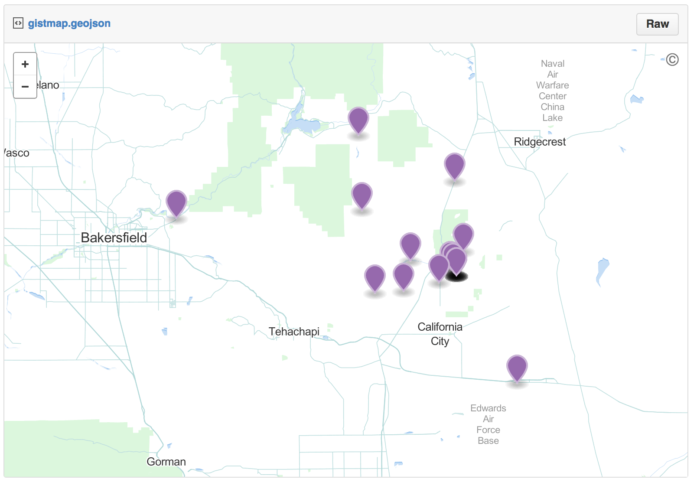

Biodiversity Mapping
--------------------

    library('spocc')
    library('mapr')

### Make a map using ggplot2

    ebird_data <- occ(query = 'Accipiter striatus', from = 'ebird')
    map_ggplot(ebird_data)

### Make a map using GitHub gists

If you have a Github Account, you can get an interactive map on Github
in one line of code. The map will open in your default browser.

    map_gist(ebird_data, color = c("#976AAE", "#6B944D", "#BD5945"))

Your turn
---------

-   5 min

> Use the other mapping options in mapr with spocc output. Also try to
> use rgbif and and make maps wit that output.
